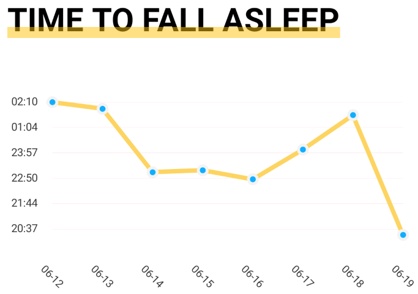
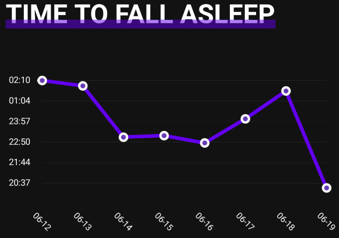
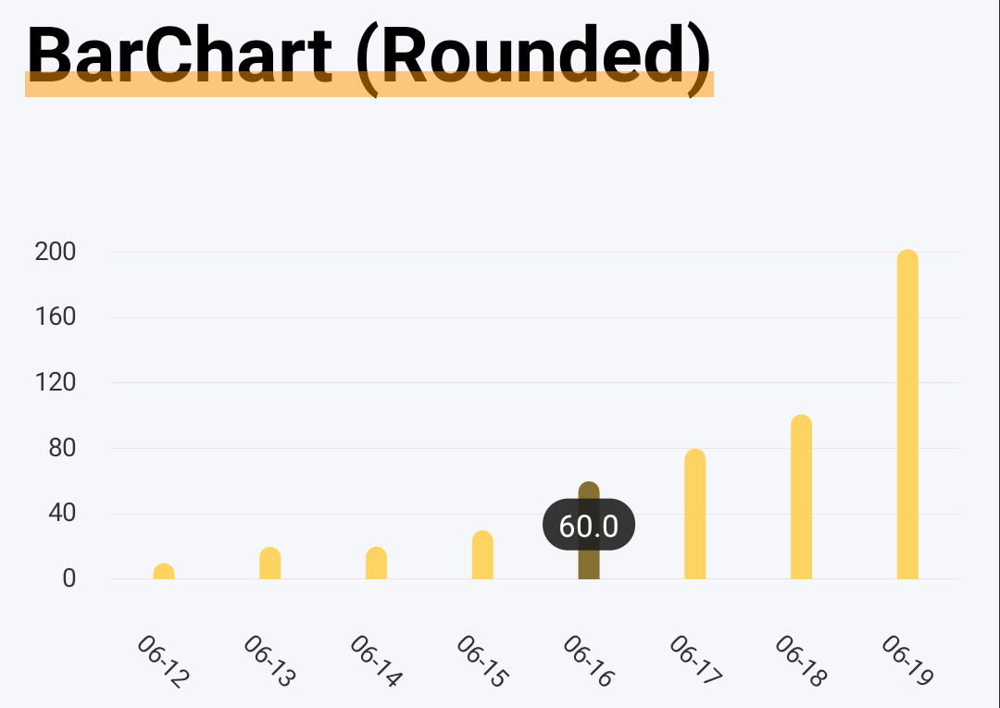
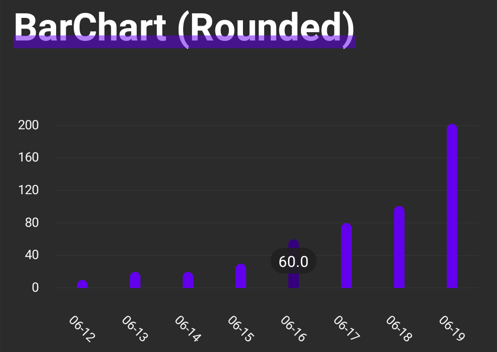
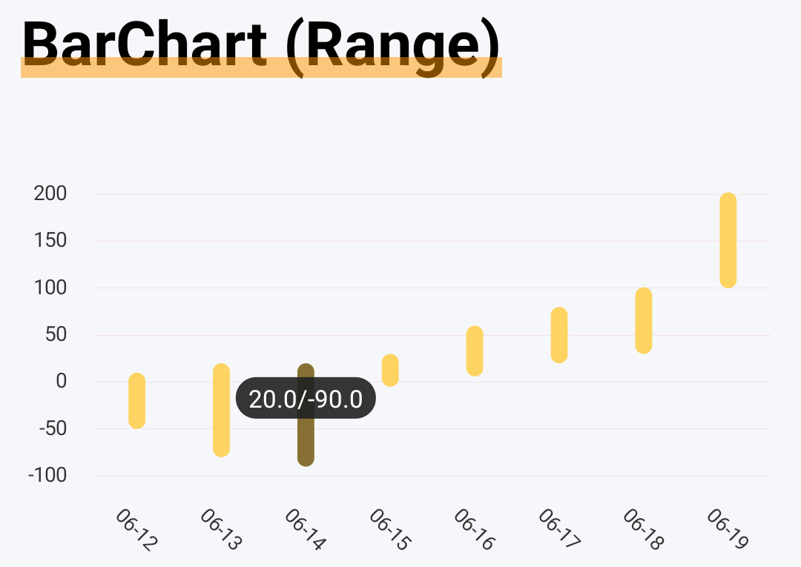
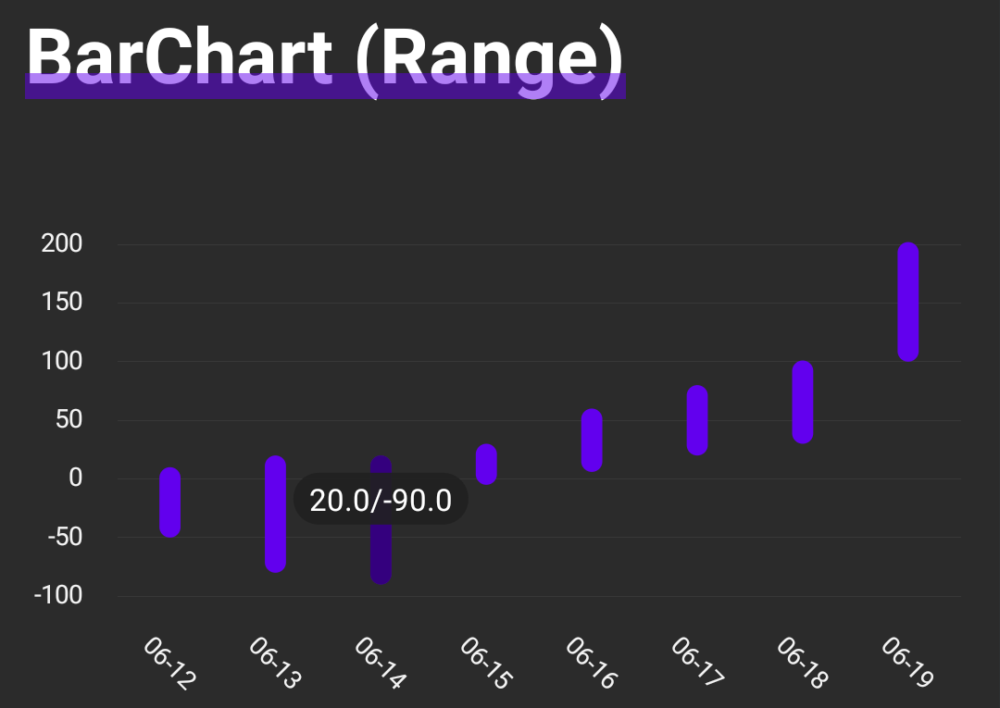

<p align="center">
 <!--  -->
 <h2 align="center"><em><strong>MPAndroidChart Demo</strong></em></h2>
 <p align="center"><em><strong>TODO.</strong></em></p>
</p>

[***> Browse MPAndroidChart Library***](https://github.com/PhilJay/MPAndroidChart)

## Big Decimal

[***> Browse Issue***](https://github.com/PhilJay/MPAndroidChart/issues/2891)

> Unfortunately, floats aren't good for handling large numbers. Once they get too far up there they'll start losing precision. Tragically, floats are all MPAndroidChart knows.
>
> Assuming your big numbers are all in the same ballpark as each other (it looks like you're using dates so I would assume so), you can work around this. When you get your first value, store it somewhere, and subtract it from every entry value as you add them. So numbers like 16314195, 16315200, 16316191 are stored as 0, 1005, 1996, and then convert them to a float. Then in a ValueFormatter for your axis, take that stored value, convert it back to the proper type, and add the stored value back in to get the original value, without loss of precision.

***Preview***

|☀|🌙|
|:-:|:-:|
|||

***Simple Data***, take ***timestamp*** as an example

Data Limit

- The data is too large, remove the end ***000***
- Change the timestamp to the first day (***e.g. 06-12***)

```text
X: 06-12 Y: 1623521449000
X: 06-13 Y: 1623520427000
X: 06-14 Y: 1623510435000
X: 06-15 Y: 1623510725000
X: 06-16 Y: 1623509282000
X: 06-17 Y: 1623513979000
X: 06-18 Y: 1623519397000
X: 06-19 Y: 1623500522000
```

[***> Browse Code***](./app/src/main/java/demo/android/mpchart/bigdecimal/BigDecimalChartActivity.kt)

## BarChart

***Preview***

|☀ ***BarChart (Rounded)***|🌙 ***BarChart (Rounded)***|
|:-:|:-:|
|||
|☀ ***BarChart (Range)***|🌙 ***BarChart (Range)***|
|||

[***> Browse Code***](./app/src/main/java/demo/android/mpchart/barchart/BarChartActivity.kt)