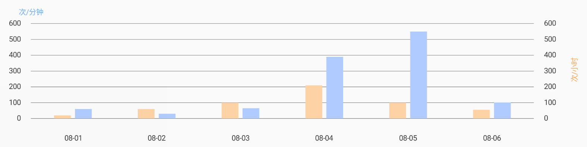
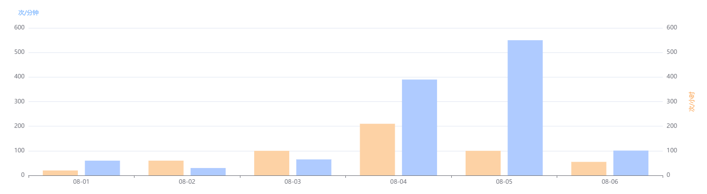

# 为图表 Y 轴添加名称 (模仿 ECharts)



***MPAndroidChart*** 实现 👆



***ECharts*** 实现 👆

## 核心实现

<details>
<summary><strong>ChartViewUtil.kt</strong></summary>

<br />

```kt
@JvmOverloads
fun YAxis.setName(
    chart: BarLineChartBase<*>?,
    name: String,
    nameLocation: Location = LocationEnd,
    nameTextStyle: NameTextStyle,
    tag: String = ""
) {
    chart?.apply {
        // 防止遮挡文本
        (chart.parent as? ViewGroup)?.apply {
            clipChildren = false
            clipToPadding = false
        }

        /*
        ----------------------------------------------------------

            Set some auxiliary lines and colors for debugging

        ----------------------------------------------------------
        */
        if (DEBUG) {
            axisLeft.apply {
                setDrawAxisLine(true)
                axisLineColor = "#8049AFF0".toColorInt()
                axisLineWidth = Utils.convertDpToPixel(2f)
            }
            axisRight.apply {
                setDrawAxisLine(true)
                axisLineColor = "#8049AFF0".toColorInt()
                axisLineWidth = Utils.convertDpToPixel(2f)
            }
            setBackgroundColor("#60C4C9CF".toColorInt())
            setDrawBorders(true)
            setBorderColor("#FF5533".toColorInt())
        }

        // 预留空间
        if (nameLocation == LocationEnd) {
            extraTopOffset = 30f
        }
        val axisDependency: YAxis.AxisDependency = this@setName.axisDependency
        if (nameLocation == LocationCenter) {
            when (axisDependency) {
                YAxis.AxisDependency.LEFT -> {
                    extraLeftOffset = 30f
                }
                YAxis.AxisDependency.RIGHT -> {
                    extraRightOffset = 30f
                }
            }
        }

        post {
            val description = Description().apply {
                isEnabled = true
                setNameTextStyle(
                    chart = chart,
                    yAxis = this@setName,
                    name = name,
                    location = nameLocation,
                    nameTextStyle = nameTextStyle,
                    tag = tag
                )
            }
            chart.addDescription(description)
        }
    }
}

private fun Description.setNameTextStyle(
    chart: BarLineChartBase<*>,
    yAxis: YAxis,
    name: String,
    location: Location,
    nameTextStyle: NameTextStyle,
    tag: String = ""
) {

    text = name
    textColor = nameTextStyle.color
    textSize = nameTextStyle.size

    val chartWidth = chart.width
    val chartHeight = chart.height
    val viewPortHandler: ViewPortHandler = chart.viewPortHandler
    //val offsetLeft = viewPortHandler.offsetLeft()
    //val offsetTop = viewPortHandler.offsetTop()
    //val offsetRight = viewPortHandler.offsetRight()
    val offsetBottom = viewPortHandler.offsetBottom()

    val contentLeft = viewPortHandler.contentLeft()
    val contentTop = viewPortHandler.contentTop()
    val contentRight = viewPortHandler.contentRight()
    val contentBottom = viewPortHandler.contentBottom()
    val descXOffset = xOffset
    val descYOffset = yOffset

    val extraLeftOffset = chart.extraLeftOffset
    val extraRightOffset = chart.extraRightOffset

    textAlign = when (nameTextStyle.align) {
        AlignLeft -> Paint.Align.LEFT
        AlignCenter -> Paint.Align.CENTER
        AlignRight -> Paint.Align.RIGHT
    }

    // 获取 Y 轴位置，Left or Right
    val axisDependency: YAxis.AxisDependency = yAxis.axisDependency

    // 如果处于居中位置，则旋转-90度绘制
    if (location == LocationCenter) {
        degrees = -90f
    }

    when (location) {
        LocationEnd -> {
            val nameX = getNameXPos(axisDependency, contentLeft, contentRight)
            val nameY = when (nameTextStyle.verticalAlign) {
                VerticalAlignTop -> {
                    contentTop - descYOffset
                }
                VerticalAlignCenter -> {
                    contentTop / 2 + descYOffset * 2
                }
                VerticalAlignBottom -> {
                    textSize
                }
            }
            nameX to nameY
        }
        LocationCenter -> {
            val nameX = when (nameTextStyle.verticalAlign) {
                VerticalAlignTop -> {
                    when (axisDependency) {
                        YAxis.AxisDependency.LEFT -> {
                            textSize
                        }
                        YAxis.AxisDependency.RIGHT -> {
                            chartWidth - textSize / 2
                        }
                    }
                }
                VerticalAlignCenter -> {
                    // TODO Check pos
                    when (axisDependency) {
                        YAxis.AxisDependency.LEFT -> {
                            extraLeftOffset
                        }
                        YAxis.AxisDependency.RIGHT -> {
                            chartWidth - extraRightOffset / 2
                        }
                    }
                }
                VerticalAlignBottom -> {
                    // TODO Check pos
                    when (axisDependency) {
                        YAxis.AxisDependency.LEFT -> {
                            extraLeftOffset + textSize
                        }
                        YAxis.AxisDependency.RIGHT -> {
                            chartWidth - extraRightOffset
                        }
                    }
                }
            }
            // TODO 待检查坐标
            val nameY = contentBottom / 2 + textSize // TODO Check maybe: + descYOffset * 2
            nameX to nameY
        }
        LocationStart -> {
            val nameX = getNameXPos(axisDependency, contentLeft, contentRight)
            // TODO 待检查坐标
            val nameY = when (nameTextStyle.verticalAlign) {
                VerticalAlignTop -> {
                    contentBottom + offsetBottom - textSize
                }
                VerticalAlignCenter -> {
                    contentBottom + offsetBottom / 2
                }
                VerticalAlignBottom -> {
                    contentBottom + textSize
                }
            }
            nameX to nameY
        }
    }.apply {
        setPosition(first, second)
    }

    // Debugging
//    ("[Chart Description ($tag)] ==>> " +
//            "chartWidth: ${chartWidth}px | " +
//            "chartHeight: ${chartHeight}px | " +
//            "descXOffset: ${descXOffset}px | " +
//            "descYOffset: ${descYOffset}px").quickErrorLog()
//    (
//            "[Chart Description ($tag)] ==>> " +
//                    "offsetLeft: ${offsetLeft}px | " +
//                    "offsetTop: ${offsetTop}px | " +
//                    "offsetRight: ${offsetRight}px | " +
//                    "offsetBottom: ${offsetBottom}px"
//            ).quickErrorLog()
}

private fun getNameXPos(
    axisDependency: YAxis.AxisDependency,
    contentLeft: Float,
    contentRight: Float
) = when (axisDependency) {
    YAxis.AxisDependency.LEFT -> {
        contentLeft
    }
    YAxis.AxisDependency.RIGHT -> {
        contentRight
    }
}

sealed class Location
object LocationStart : Location()
object LocationCenter : Location()
object LocationEnd : Location()

sealed class Align
object AlignLeft : Align()
object AlignCenter : Align()
object AlignRight : Align()

sealed class VerticalAlign
object VerticalAlignTop : VerticalAlign()
object VerticalAlignCenter : VerticalAlign()
object VerticalAlignBottom : VerticalAlign()

class NameTextStyle(
    @Px val size: Float = 10f,
    @ColorInt val color: Int = R.color.COLOR_666666.obtainColor(),
    val align: Align = AlignCenter,
    val verticalAlign: VerticalAlign = VerticalAlignCenter
)

private const val DEBUG = true
```
</details>

## 修改 `Description` 类

```diff
+ private float degrees;

+ public float getDegrees() {
+     return degrees;
+ }

+ public void setDegrees(float degrees) {
+     this.degrees = degrees;
+ }
```

## 修改 `Chart` 类

<details>
<summary><strong>Chart.java</strong></summary>

<br />

```java
protected List<Description> mDescriptions;

...

public void addDescription(Description desc) {
    if (mDescriptions == null) {
        mDescriptions = new ArrayList < > ();
        Description description = getDescription ();
        if (description != null) {
            mDescriptions.add(description);
        }
    }
    if (desc != null) {
        MPPointF position = desc . getPosition ();
        // Only receive descriptions of custom positions
        if (position != null) {
            boolean positionRepeat = false;
            for (Description description : mDescriptions) {
                MPPointF that = description . getPosition ();
                if (that != null) {
                    positionRepeat = Float.compare(that.x, position.x) == 0 && Float.compare(
                        that.y,
                        position.y
                    ) == 0;
                }
            }
            // If the position does not coincide, add it
            if (!positionRepeat) {
                mDescriptions.add(desc);
            }
        }
    }
}

public List<Description> getDescriptions() {
    return mDescriptions;
}

protected void drawDescription(Canvas c) {
    if (mDescriptions != null && mDescriptions.size() > 0) {
        for (Description description : mDescriptions) {
            drawDescriptionInternal(c, description);
        }
    } else {
        drawDescriptionInternal(c, mDescription);
    }
}

protected void drawDescriptionInternal(Canvas c, Description description) {
    // check if description should be drawn
    if (description != null && description.isEnabled()) {

        MPPointF position = description . getPosition ();

        mDescPaint.setTypeface(description.getTypeface());
        mDescPaint.setTextSize(description.getTextSize());
        mDescPaint.setColor(description.getTextColor());
        mDescPaint.setTextAlign(description.getTextAlign());

        float x, y;

        // if no position specified, draw on default position
        if (position == null) {
            x = getWidth() - mViewPortHandler.offsetRight() - description.getXOffset();
            y = getHeight() - mViewPortHandler.offsetBottom() - description.getYOffset();
        } else {
            x = position.x;
            y = position.y;
        }
        if (null != description.getText()) {
            c.save();
            float degrees = description.getDegrees();
            if (degrees != 0) {
                c.rotate(degrees, x, y);
            }
            c.drawText(description.getText(), x, y, mDescPaint);
            c.restore();
        }
    }
}
```
</details>

## 使用

```kt
barChart.axisLeft.setName(
    barChart,
    "次/分钟",
    nameLocation = LocationEnd,
    nameTextStyle = NameTextStyle(
        size = 10f,
        color = R.color.COLOR_6cadff.obtainColor(),
        align = AlignCenter,
        verticalAlign = VerticalAlignBottom
    ),
    tag = "Left y-axis"
)
barChart.axisRight.setName(
    barChart,
    "次/小时",
    nameLocation = LocationCenter,
    nameTextStyle = NameTextStyle(
        size = 10f,
        color = R.color.COLOR_FBA655.obtainColor(),
        align = AlignCenter,
        verticalAlign = VerticalAlignCenter
    ),
    tag = "Right y-axis"
)
```


<!-- ECharts Option -->
<!-- var colors = ['#fdd2a5', '#afcbff'];

option = {
    color: colors,
    tooltip: {
        trigger: 'axis',
        axisPointer: {
            type: 'cross',
            crossStyle: {
                color: '#000'
            }
        }
    },
    toolbox: {
        feature: {

        }
    },
    xAxis: [
        {
            type: 'category',
            data: ['08-01', '08-02', '08-03', '08-04', '08-05', '08-06'],
            axisPointer: {
         
        type: 'shadow'
            }
        }
    ],
    yAxis: [
        {
            type: 'value',
            min: 0,
            max: 600,
            nameLocation: 'end',
            nameGap: 30,
            nameTextStyle: {
                color: '#6cadff',
                align: 'center',
                verticalAlign: 'center'
            },
            name: '次/分钟',
        },
        {
            type: 'value',
            min: 0,
            max: 600,
            nameGap: 60,
            nameTextStyle: {
                color: '#fba655',
                align: 'center',
                verticalAlign: 'center'
            },
            nameLocation: 'center',
            name: '次/小时',
        }
    ],
    series: [
        {
            name: '',
            type: 'bar',
            yAxisIndex: 0,
            data: [20, 60, 100, 210, 100, 55]
        },
        {
            name: '',
            type: 'bar',
            yAxisIndex: 1,
            data: [60, 30, 65, 390, 550, 101]
        }
    ]
}; -->